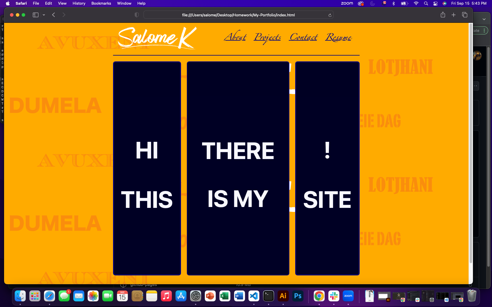
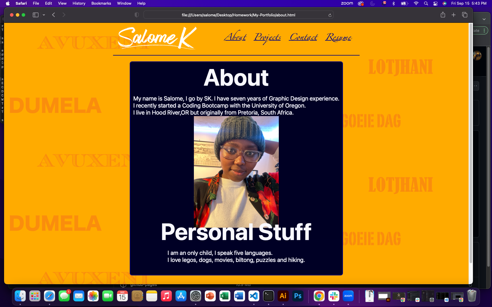
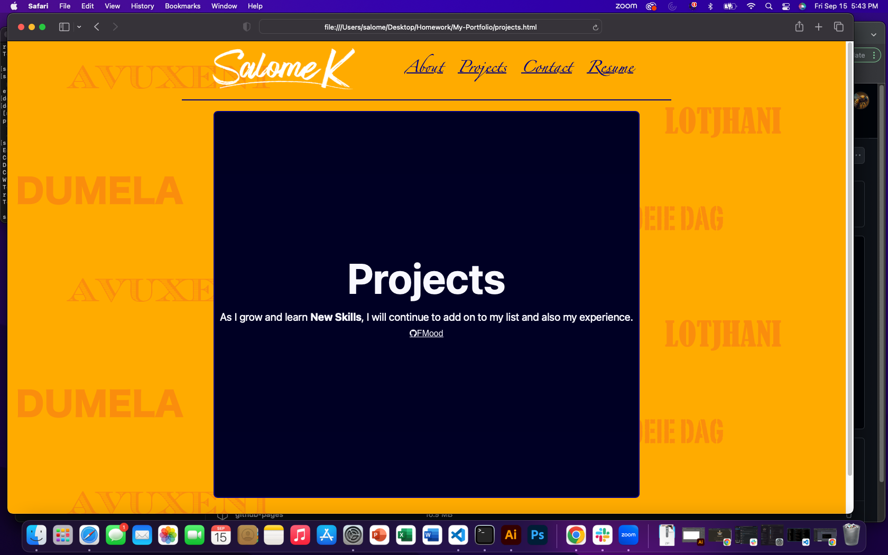
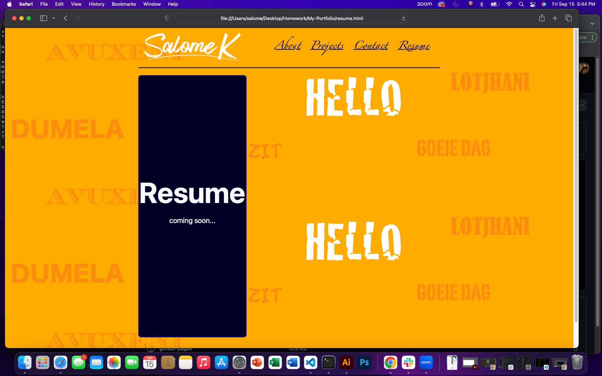

# Portfolio of SalomeK Mphago

## About The Project

This week we were tasked with creating a web application from scratch. I built a one page portfolio using the html and css skills I have learned so far.

The Portfolio clearly states my name, it has a picture of what I look like for a Potential Employer and just incase the person viewing my Portfolio wants to know what I look like.

## Important Links:

Deployed URL: https://saiishago.github.io/My-Portfolio/

Github URL: https://github.com/Saiishago/My-Portfolio

## What Is In The Project

My-Portfolio consists of Five Pages. The main(body) background image is a wallpaper I created with all the ways you can greet a person in South Africa.
I used a grid to structure all my content.

### Home Page
The home page is just a welcome page.

### About Page
The about page contains a paragraph about my work experience, where I live and where I am from.

### Projects Page
The projects page has the first project we just completed for school.

### Resume Page
The resume page will be updated as I progress with this class, so here I just added some fun 'updated version coming soon' text and added a hover effect.

### Contact Page
This page has four links a user can click on in order to be redirected to my work social media platforms to learn more about me or to view some of my other work.
](Images/ContactPage.png)